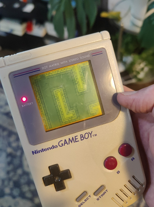
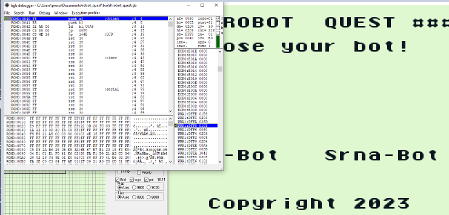

# Robot Quest

This is a game for the original Game Boy console, created to learn about making
Game Boy games.

# Prerequisites

Development was done on a Ubuntu 20 Linux PC. It is assumed a similar
environment is used. It's likely other environments could work as well.

## cmake 3.16+

## python 3.10+

## The gbdk-2020 development kit:

`git clone` gbdk-2020 from https://github.com/gbdk-2020/gbdk-2020 to somewhere on your PC.

Set environment variable GBDK_HOME to the root of its directory tree.

## The rgbds assembler:

This is used by the music driver hUGEDriver

https://github.com/gbdev/rgbds

The `rgbasm` application should be available in $PATH

## A special modified version of sdcc (Small Devices C Compiler)

These are available from https://github.com/gbdk-2020/gbdk-2020-sdcc/releases -
download a binary distribution appropriate for your PC, and set envionrment
variable SDCCDIR to where this has been extracted

# Building

Run `cmake -DCMAKE_TOOLCHAIN_FILE=cmake/lcc.toolchain.cmake -Bbuild && cmake --build build`

Expect to see:

```
Found LCC at /home/precosky/gbdk/gbdk-2020/build/gbdk/bin/lcc
Found LCC at /home/precosky/gbdk/gbdk-2020/build/gbdk/bin/lcc
-- The C compiler identification is SDCC 4.3.2
-- Check for working C compiler: /home/precosky/gbdk/gbdk-2020/build/gbdk/bin/lcc
Found LCC at /home/precosky/gbdk/gbdk-2020/build/gbdk/bin/lcc
-- Check for working C compiler: /home/precosky/gbdk/gbdk-2020/build/gbdk/bin/lcc -- works
-- Detecting C compiler ABI info
Found LCC at /home/precosky/gbdk/gbdk-2020/build/gbdk/bin/lcc
-- Detecting C compiler ABI info - done
-- Configuring done
-- Generating done
-- Build files have been written to: /home/precosky/robot_quest/build
Scanning dependencies of target robot_quest
[ 25%] Building C object CMakeFiles/robot_quest.dir/src/main.c.rel
[ 50%] Building C object CMakeFiles/robot_quest.dir/res/dungeon_map.c.rel
[ 75%] Building C object CMakeFiles/robot_quest.dir/res/dungeon_tiles.c.rel
[100%] Linking C executable robot_quest.gb
[100%] Built target robot_quest
```

# Running

Expect a cartridge ROM to be produced at `build/robot_quest.gb`. Load it into a
flash cart and place it into a Game Boy, or load it in your favourite Game Boy
emulator.

## Running On a Physical Game Boy:



## Running In an Emulator:



# Template Note

This project was created from a gbdk-2020 template, which included the following readme:


A template project with a Makefile that supports sub-directories.

The Makefile will automatically detect and compile new source files
when they are added to the "src" and "res" directories.

Project directories
  - src: Main program source files (.c, .h, .s) can go here
  - res: Program graphics and audio source files (.c, .h, .s) can go here
  - obj: Compiled ROM (.gb) and debug files go in this directory


== Sprite and Background tiles from: ==

https://sondanielson.itch.io/gameboy-simple-rpg-tileset
"Licence is under CCA so you can use these assets both privately and commercially"
"You are free to use them as is or modify them to your liking. All i ask is you credit me if you do use them please :)"
